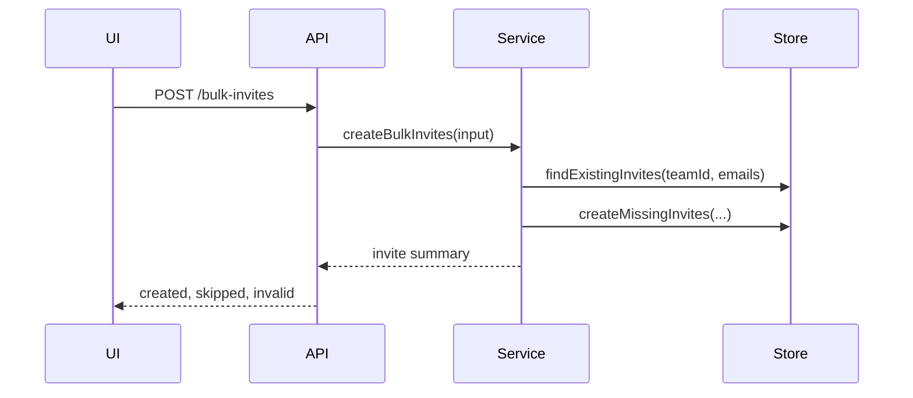

# Interface Design Spike Skill

## Purpose

Use this skill to align on system shape before full implementation.

Starting with this phase, the user should see code-level contracts. The code may still be exploratory, but the intended interfaces should be concrete enough to inspect.

This skill covers more than HTTP APIs. Use it for service boundaries, TypeScript interfaces, database schemas, event shapes, agent tool contracts, UI component contracts, persisted domain concepts, and source-of-truth decisions.

## When To Use

Use this skill when the work introduces or changes:

- Public APIs
- Internal service interfaces
- Persistent schemas
- Domain entities
- Agent tools or model-editable files
- Event or transcript shapes
- UI component contracts
- Source-of-truth boundaries
- Cross-system integration contracts

Use this especially when the agent is creating a new concept rather than adding another method to an existing concept.

## Obligations

Show both:

1. A diagram of the system/data flow
2. Actual code-level contracts

The goal is to make interface decisions visible before they disappear into implementation.

## Diagrams

Use diagrams to show how data and responsibility flow. Mermaid is usually enough.

Useful diagram types:

- Sequence diagram
- Component diagram
- Data flow diagram
- State transition diagram
- Source-of-truth diagram

Example:



## Code-Level Contracts

Show the intended interface in code.

Examples:

- TypeScript interfaces
- Zod schemas
- route signatures
- service interfaces
- event types
- tool input/output schemas
- example request/response bodies
- database migration sketches

Example:

```ts
export interface BulkInviteRequest {
  teamId: string;
  rows: Array<{
    email: string;
    role: 'member' | 'admin';
  }>;
}

export interface BulkInviteResult {
  created: Array<{
    email: string;
    inviteId: string;
    status: 'pending';
  }>;
  skipped: Array<{
    email: string;
    reason: 'already_invited' | 'already_member';
  }>;
  invalid: Array<{
    rowIndex: number;
    email: string;
    reason: string;
  }>;
}

export interface TeamInviteService {
  createBulkInvites(input: BulkInviteRequest): Promise<BulkInviteResult>;
}
```

## Stability Classification

Classify each interface by change cost.

Low risk:

- Local helper function
- Internal private type
- Another method following an existing service pattern

Medium risk:

- Shared internal DTO
- UI component contract used by several components
- Service method likely to be reused

High risk:

- Persisted schema
- Public API
- Domain entity
- Source-of-truth model
- Cross-system contract
- Agent tool contract that future prompts/models depend on
- User-visible workflow state

High-risk interfaces require explicit attention and, when product-relevant, user approval.

## Source Of Truth

State where truth lives.

Ask:

- What owns the canonical state?
- What is a projection, cache, view model, generated file, or temporary workspace?
- What can be recomputed?
- What must be persisted?
- What happens on resume, refresh, retry, conflict, or rollback?

If this is unclear, do not proceed to full implementation.

## Error And Failure Shape

Define important error paths early, especially when product or architecture depends on them.

Ask:

- Which errors are user-visible?
- Which errors fail closed?
- Which errors can be retried?
- Which errors are audited?
- Which errors should not block unrelated valid work?
- What is the API response or event shape for failure?

Non-trivial error paths may need to appear in the implementation demo.

## Volatility Response

Use the technical spike's volatility findings.

If a contract is volatile:

- Keep it internal if possible.
- Put it behind an adapter.
- Avoid persisting unstable semantics.
- Prefer explicit versioning or migration strategy when persistence is unavoidable.
- Do not introduce broad generic bags unless the boundary genuinely requires them.

## Exit Criteria

Leave this skill only when:

- The major interfaces are visible in diagrams and code.
- New concepts are named and justified.
- Stable versus provisional contracts are clear.
- Source of truth is clear.
- High-risk API/schema/domain changes are called out.
- The user has enough concrete material to inspect the direction.
